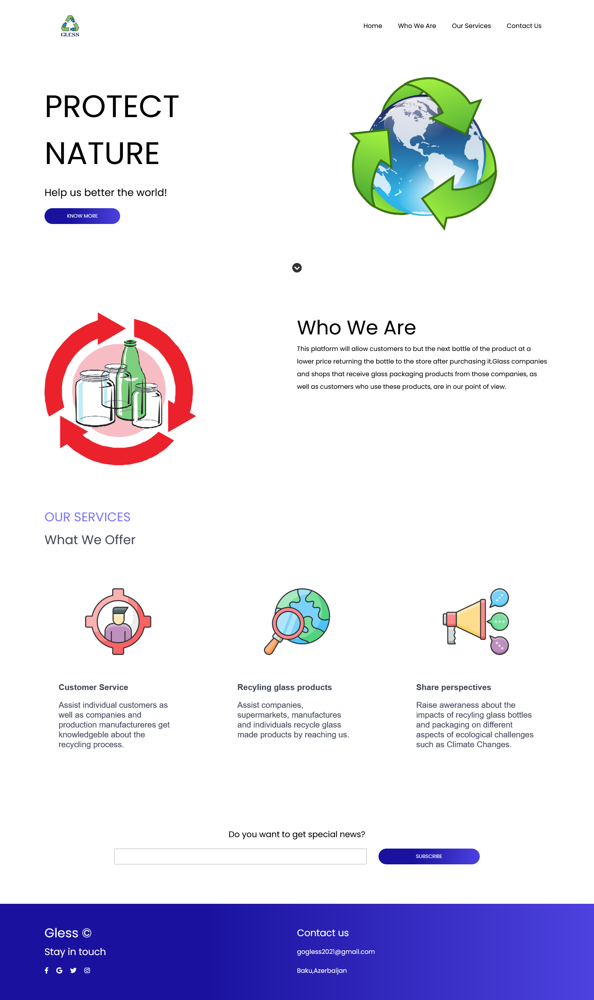

This platform will allow customers to buy the next bottle of the product at a lower price by returning the bottle to the store after purchasing it.Glass companies and shops that receive glass packaging products from those companies, as well as customers who use these products, are in our point of view. 

## Table of contents
- [Screenshots](#screenshots)
- [Links](#links)
- [Built with](#built-with)
- [Continued development](#continued-development)
- [Useful resources](#useful-resources)

### Screenshot

### Links
- Live Site URL: [https://gogless.github.io/Gless/](https://gogless.github.io/Gless/)

### Built with

- Semantic HTML5 markup
- CSS custom properties
- Flexbox
- CSS Grid

### Continued development

In safe circumstances and continous improvements on our project,we will be developing our platform with fresh and new UI/UX design.

### Useful resources

- [https://fontawesome.com/](https://fontawesome.com/) - This tool helped us use social media icons for our webpage.
- [https://cssgradient.io/](https://cssgradient.io/) - This website helped us come up with gradient background wich we have used at several parts of our website.
- [https://www.svgrepo.com/](https://www.svgrepo.com/) - Another great tool which asissted us with great icons.

